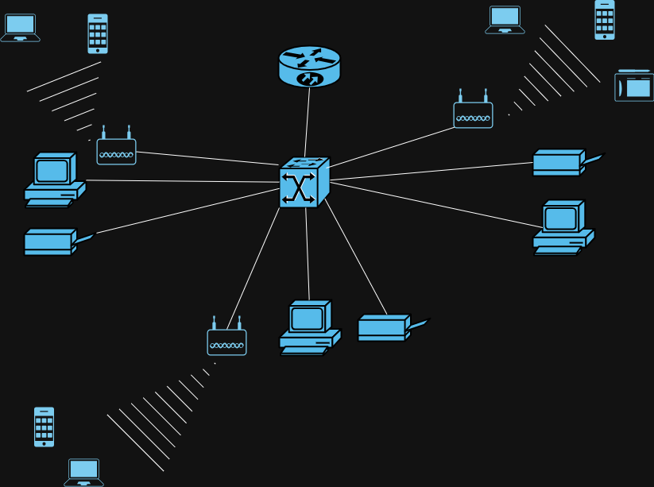

# SOHO-Network-Design-and-Implementation

## Project Overview

This project involves designing and implementing a small office/home office (SOHO) network using Cisco Packet Tracer. The project meets the requirements of XYZ Company, a fast-growing enterprise intending to expand to a branch network in Bonalbo village. The network is separated from the headquarters (HQ) and is configured with the following key objectives:

- **One router and one switch** are used.
- The network is segmented into **three departments**: Admin/IT, Finance/HR, and Customer Service/Reception.
- Each department is assigned to a separate **VLAN**.
- **Wireless connectivity** is provided for all users.
- **DHCP** is configured to allow host devices to obtain IPv4 addresses automatically.
- Devices across all departments are able to communicate with each other through **inter-VLAN routing**.

## Network Design

### Devices and Topology
The SOHO network design includes the following:

- **Router**: Cisco 2911 Router (Router0)
- **Switch**: Cisco 2960 Switch (Switch0)
- **Access Points**: For wireless connectivity across departments.
- **End Devices**: PCs, Laptops, Smartphones, Tablets, and Printers.

### VLAN Configuration
- **Admin/IT Department** - VLAN 10
  - Devices: 2 PCs, 1 Printer, 1 Access Point, Laptops, Smartphones.
- **Finance/HR Department** - VLAN 20
  - Devices: 2 PCs, 1 Printer, 1 Access Point, Laptops, Smartphones.
- **Customer Service/Reception** - VLAN 30
  - Devices: 2 PCs, 1 Printer, 1 Access Point, Laptops, Smartphones, Tablets.

### IP Addressing Scheme
The company is provided with a base network of **192.168.1.0/24**. Subnets are created for each VLAN, and the last usable IP address in each subnet is assigned to the router.

- **VLAN 10 (Admin/IT)**: 
  - Network: 192.168.1.0/26
  - Router IP: 192.168.1.62 (Last usable IP)
- **VLAN 20 (Finance/HR)**:
  - Network: 192.168.1.64/26
  - Router IP: 192.168.1.126 (Last usable IP)
- **VLAN 30 (CS/Reception)**:
  - Network: 192.168.1.128/26
  - Router IP: 192.168.1.190 (Last usable IP)
  
### Inter-VLAN Routing
- Configured on **Router0** to allow communication between devices in different VLANs.
  
### DHCP Configuration
- **DHCP pools** were configured on Router0 to allocate IPv4 addresses dynamically to devices in each VLAN.

### Wireless Network
- Each department is equipped with **Access Points** to provide wireless network connectivity to laptops, smartphones, and tablets.

### Diagram
Below is a visual representation of the network topology:



## Configuration Steps

### 1. VLAN Setup on the Switch
VLANs were created for each department:
```bash
Switch(config)# vlan 10
Switch(config-vlan)# name Admin_IT

Switch(config)# vlan 20
Switch(config-vlan)# name Finance_HR

Switch(config)# vlan 30
Switch(config-vlan)# name CS_Reception
```

### 2. Assigning Interfaces to VLANs
Each department's devices were assigned to their respective VLANs:
```bash
Switch(config)# interface range fa0/1-4
Switch(config-if-range)# switchport mode access
Switch(config-if-range)# switchport access vlan 10

Switch(config)# interface range fa0/5-8
Switch(config-if-range)# switchport mode access
Switch(config-if-range)# switchport access vlan 20

Switch(config)# interface range fa0/9-12
Switch(config-if-range)# switchport mode access
Switch(config-if-range)# switchport access vlan 30
```

### 3. Inter-VLAN Routing on the Router
Sub-interfaces were configured on Router0 to enable communication between VLANs:
```bash
Router(config)# interface g0/0.10
Router(config-subif)# encapsulation dot1Q 10
Router(config-subif)# ip address 192.168.1.62 255.255.255.192

Router(config)# interface g0/0.20
Router(config-subif)# encapsulation dot1Q 20
Router(config-subif)# ip address 192.168.1.126 255.255.255.192

Router(config)# interface g0/0.30
Router(config-subif)# encapsulation dot1Q 30
Router(config-subif)# ip address 192.168.1.190 255.255.255.192
```

### 4. DHCP Configuration
DHCP pools were configured to dynamically assign IP addresses to devices in each VLAN:
```bash
Router(config)# ip dhcp pool VLAN10
Router(dhcp-config)# network 192.168.1.0 255.255.255.192
Router(dhcp-config)# default-router 192.168.1.62

Router(config)# ip dhcp pool VLAN20
Router(dhcp-config)# network 192.168.1.64 255.255.255.192
Router(dhcp-config)# default-router 192.168.1.126

Router(config)# ip dhcp pool VLAN30
Router(dhcp-config)# network 192.168.1.128 255.255.255.192
Router(dhcp-config)# default-router 192.168.1.190
```

### 5. Testing and Verification
- Devices were connected and tested for network connectivity.
- **Ping tests** were conducted between devices in different VLANs to confirm that inter-VLAN routing was functioning correctly.
- **DHCP** was tested by verifying that devices obtained dynamic IP addresses in the correct ranges.

## Conclusion
This SOHO network design effectively segments the network into three departments using VLANs, ensuring both wired and wireless connectivity for all devices. Inter-VLAN routing allows communication between departments, and DHCP ensures that devices are automatically assigned IP addresses.

---
